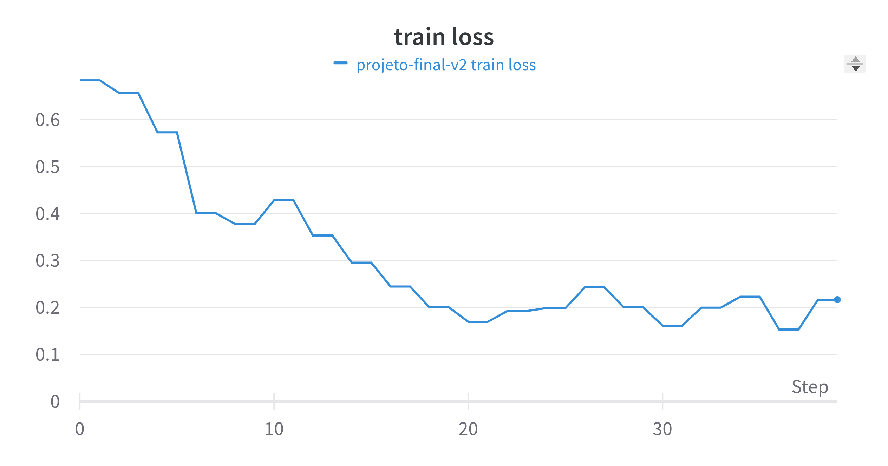
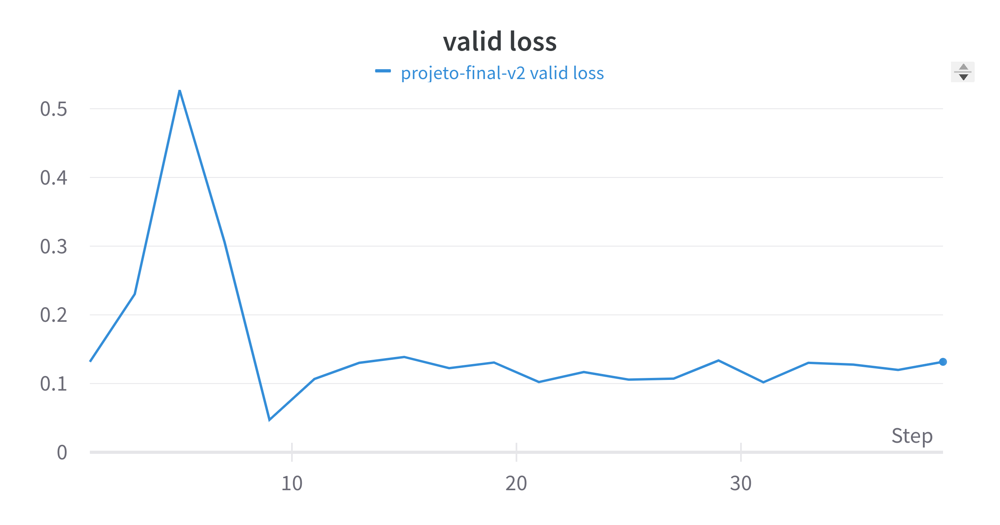
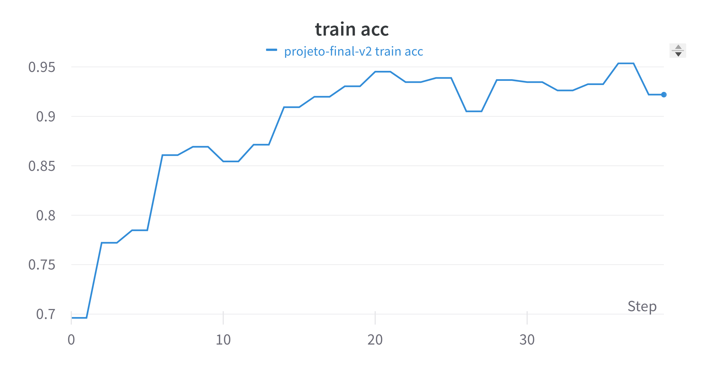
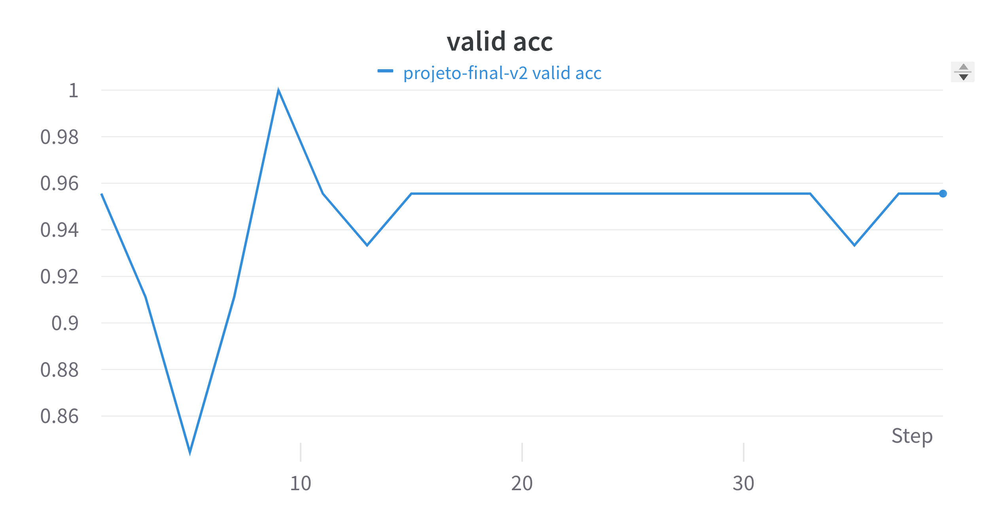

# Projeto Final - Modelos Preditivos Conexionistas

### Felipe Augusto Marques de Alcântara

|**Tipo de Projeto**|**Modelo Selecionado**|**Linguagem**|
|--|--|--|
|Classificação de Imagens|ResNet18|PyTorch|

## Performance

O modelo treinado possui performance de **94,1%** (valor obtido a partir da média dos valores de acurácia no conjunto de validação).

### Output do bloco de treinamento

<details>
  <summary>Clique para expandir!</summary>
  
  ```text

model_ft = train_model(model_ft, criterion, optimizer_ft, exp_lr_scheduler,
                       num_epochs=20)
output
Epoch 0/19
----------
train Loss: 0.6844 Acc: 0.6962
This DataLoader will create 4 worker processes in total. Our suggested max number of worker in current system is 2, which is smaller than what this DataLoader is going to create. Please be aware that excessive worker creation might get DataLoader running slow or even freeze, lower the worker number to avoid potential slowness/freeze if necessary.
valid Loss: 0.1317 Acc: 0.9556

Epoch 1/19
----------
train Loss: 0.6573 Acc: 0.7722
valid Loss: 0.2303 Acc: 0.9111

Epoch 2/19
----------
train Loss: 0.5728 Acc: 0.7848
valid Loss: 0.5271 Acc: 0.8444

Epoch 3/19
----------
train Loss: 0.4008 Acc: 0.8608
valid Loss: 0.3058 Acc: 0.9111

Epoch 4/19
----------
train Loss: 0.3777 Acc: 0.8692
valid Loss: 0.0472 Acc: 1.0000

Epoch 5/19
----------
train Loss: 0.4283 Acc: 0.8544
valid Loss: 0.1066 Acc: 0.9556

Epoch 6/19
----------
train Loss: 0.3534 Acc: 0.8713
valid Loss: 0.1302 Acc: 0.9333

Epoch 7/19
----------
train Loss: 0.2955 Acc: 0.9093
valid Loss: 0.1387 Acc: 0.9556

Epoch 8/19
----------
train Loss: 0.2447 Acc: 0.9198
valid Loss: 0.1224 Acc: 0.9556

Epoch 9/19
----------
train Loss: 0.2003 Acc: 0.9304
valid Loss: 0.1306 Acc: 0.9556

Epoch 10/19
----------
train Loss: 0.1696 Acc: 0.9451
valid Loss: 0.1022 Acc: 0.9556

Epoch 11/19
----------
train Loss: 0.1923 Acc: 0.9346
valid Loss: 0.1168 Acc: 0.9556

Epoch 12/19
----------
train Loss: 0.1987 Acc: 0.9388
valid Loss: 0.1057 Acc: 0.9556

Epoch 13/19
----------
train Loss: 0.2430 Acc: 0.9051
valid Loss: 0.1071 Acc: 0.9556

Epoch 14/19
----------
train Loss: 0.2006 Acc: 0.9367
valid Loss: 0.1336 Acc: 0.9556

Epoch 15/19
----------
train Loss: 0.1613 Acc: 0.9346
valid Loss: 0.1018 Acc: 0.9556

Epoch 16/19
----------
train Loss: 0.1998 Acc: 0.9262
valid Loss: 0.1302 Acc: 0.9556

Epoch 17/19
----------
train Loss: 0.2230 Acc: 0.9325
valid Loss: 0.1276 Acc: 0.9333

Epoch 18/19
----------
train Loss: 0.1532 Acc: 0.9536
valid Loss: 0.1198 Acc: 0.9556

Epoch 19/19
----------
train Loss: 0.2167 Acc: 0.9219
valid Loss: 0.1316 Acc: 0.9556

Training complete in 52m 55s
Best val Acc: 1.000000
  ```
</details>

### Evidências do treinamento

Nessa seção você deve colocar qualquer evidência do treinamento, como por exemplo gráficos de perda, performance, matriz de confusão etc.

- Gráficos de Perda:
  - Train Loss:



  - Valid Loss:



- Gráficos de Acurácia:
  - Train Acc:



  - Valid Acc



## Roboflow

Nessa seção deve colocar o link para acessar o dataset no Roboflow

Link: [Roboflow-Projeto-Final](https://universe.roboflow.com/cesar-ysahw/modelos-preditivos-conexionistas)

## HuggingFace

Nessa seção você deve publicar o link para o HuggingFace

Link: [HuggingFace-Projeto-Final](https://huggingface.co/augustof/modelos-preditivos-conexionistas-projeto-final)
